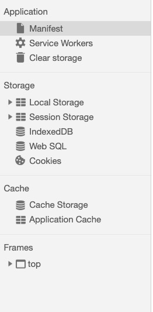

- indexdb-test indexDB的测试文件
- mf-test manifest的测试文件
- sw-test Service Workers的测试文件文件
- web.html Web SQL 的测试文件文件

打开浏览器的Application显示如下




### manifest [mdn解析](https://developer.mozilla.org/en-US/docs/Web/Manifest)
  
> Web应用程序清单使用文档<head>中的<link>元素部署在HTML页面中：
```
<link rel=manifest href=manifest.json>
```

> manifest.json的代码
```
{
    "name": "HackerWeb", // 在向用户显示时为站点提供可读的名称。例如，在其他应用程序列表中或作为图标的标签。
    "short_name": "HackerWeb", // 为应用程序提供简短的人类可读名称。这适用于没有足够空间显示Web应用程序的全名，例如设备主屏幕。
    "start_url": "/mf-test/", // 用户启动应用程序时加载的URL（例如，当添加到主屏幕时），通常是索引。请注意，这必须是相对于清单URL的相对URL。
    "display": "standalone", // 定义开发人员首选的网站显示模式。
    "background_color": "#fff",
    "description": "A simply readable Hacker News app.",
    "icons": [
        {
        "src": "./img/logo.png",
        "sizes": "512x512",
        "type": "image/png"
        },
        {
        "src": "./img/logo.jpg",
        "sizes": "512x512",
        "type": "image/jpg"
        }
    ]
}
```
> 清除缓存的方法   

(1)更新manifest文件   
(2)通过javascript操作  `window.applicationCache.update();` 
(3)清除浏览器缓存   


> 浏览器的支持情况

type | Chrome | Firefox (Gecko) | IE | Opera | Safari (WebKit)
---|---|---|---|---|---
桌面浏览器 | 39.0 | 不支持 | 不支持 | 不支持 | 不支持


> 移动端的支持情况

type | Android | Android Webview | Firefox Mobile (Gecko) | IE Mobile | Opera Mobile | Safari Mobile | Chrome for Android
---|---|---|---|---|---|---|---
手机端 | 不支持 | 39.0 | ？ | ？ | 32.0 | ？ | 39.0
background_color | 不支持 | 46.0 [1] | ？ | ？ | （是） | ？ | 46.0 [1]
theme_color | 不支持 | 46.0 [1] | ？ | ？ | 不支持 | ？ | 46.0 [1]
icons，name，short_name，和theme_color用于添加到主屏幕的功能。 | ？ | （是） | 53.0（53）[2] | ？ | 不支持 | ？ | （是）
display | ？ | （是） | 47.0（47）[3] | 不支持 | ？ | ？ | （是）

> 特点
  1. 即使online,也是先从appcache里获取数据.页面完成呈现后，浏览器将查找清单和缓存文件的更新。
  2. 如果清单本身的内容发生了变化，APPLICATIONCACHE只会更新
  3. manifest是​​一个额外的缓存，而不是替代缓存从来没有远期缓存清单
  4. 非缓存资源不会在缓存页面上加载
  5. 仅将ApplicationCache用于静态内容

---

###  Service Workers 可以使你的应用先访问本地缓存资源，所以在离线状态时，在没有通过网络接收到更多的数据前，仍可以提供基本的功能（一般称之为 Offline First）。这是原生APP 本来就支持的功能，这也是相比于 web app，原生 app 更受青睐的主要原因。  [mdn详解](https://developer.mozilla.org/zh-CN/docs/Web/API/Service_Worker_API/Using_Service_Workers) [github例子](https://github.com/mdn/sw-test/)

> 特点

1. 是谷歌提出的
2. 必须是https的链接
3. service worker文件的地址相对于 origin , 而不是 app 的根目录。在我们的例子例， service worker 是在 https://static-sit.gomemyf.com/sw-test/sw.js，app 的根目录是 https://static-sit.gomemyf.com/sw-test/。应该写成 /sw-test/sw.js 而非 /sw.js.
4. 只能缓存前端的文件,不能缓存请求的接口
5. 同域都可以访问

> 浏览器的支持情况

type | Chrome | Firefox (Gecko) | IE | Opera
---|---|---|---|---|---
桌面浏览器 | 40.0 | 44.0 (44.0)[1] | 未实现 | 24 | 未实现

> 移动端的支持情况

type | Android | Android Webview | Firefox Mobile (Gecko) | Firefox OS | IE Mobile | Opera Mobile | Safari Mobile | Chrome for Android
---|---|---|---|---|---|---|---|---
手机端 | 未实现 | 未实现 | 44.0 (44.0) | (Yes) | 未实现 | ? | 未实现 | 40.0


> 状态值
```
ServiceWorker.state // 返回服务工作者的状态。它返回下列值之一：installing，installed, activating，activated，或redundant。 
// 监听状态值的变化 
serviceWorker.addEventListener('statechange', function (e) {
  console.log('e.target.state::::', e.target.state);
});
``` 
    
> 清除缓存的方法
1. js代码
```
self.addEventListener('activate', function(event) {
  var cacheWhitelist = ['v2'];
  event.waitUntil(
    caches.keys().then(function(keyList) {
      return Promise.all(keyList.map(function(key) {
        if (cacheWhitelist.indexOf(key) === -1) {
          return caches.delete(key);
        }
      }));
    })
  );
});
2. 手动清除
3. 更新文件
```

---

### indexDB  [阮一峰讲解](http://www.ruanyifeng.com/blog/2018/07/indexeddb.html)


> 特点:    

 (1）键值对储存。 IndexedDB 内部采用对象仓库（object store）存放数据。所有类型的数据都可以直接存入，包括 JavaScript 对象。对象仓库中，数据以"键值对"的形式保存，每一个数据记录都有对应的主键，主键是独一无二的，不能有重复，否则会抛出一个错误。

（2）异步。 IndexedDB 操作时不会锁死浏览器，用户依然可以进行其他操作，这与 LocalStorage 形成对比，后者的操作是同步的。异步设计是为了防止大量数据的读写，拖慢网页的表现。

（3）支持事务。 IndexedDB 支持事务（transaction），这意味着一系列操作步骤之中，只要有一步失败，整个事务就都取消，数据库回滚到事务发生之前的状态，不存在只改写一部分数据的情况。

（4）同源限制 IndexedDB 受到同源限制，每一个数据库对应创建它的域名。网页只能访问自身域名下的数据库，而不能访问跨域的数据库。

（5）储存空间大 IndexedDB 的储存空间比 LocalStorage 大得多，一般来说不少于 250MB，甚至没有上限。

（6）支持二进制储存。 IndexedDB 不仅可以储存字符串，还可以储存二进制数据（ArrayBuffer 对象和 Blob 对象）。

>  支持增删改查,和mongdb类似
```
数据库： IDBDatabase 对象
对象仓库： IDBObjectStore 对象
索引：  IDBIndex 对象
事务：  IDBTransaction 对象
操作请求： IDBRequest 对象
指针：  IDBCursor 对象
主键集合：IDBKeyRange 对象
```

> 浏览器的支持情况

（1）IE10起支持   
（2）Firefox 10、Chrome 23、Opera 15   
（3）最新版的桌面版或移动版的Safari也支持IndexedDB。   


---


### web SQL
 -  websql并未列入html标准中,只有chrome、Safari等部分webkit浏览器支持,其他浏览器均不支持IE11仅部分支持IndexedDB数据库